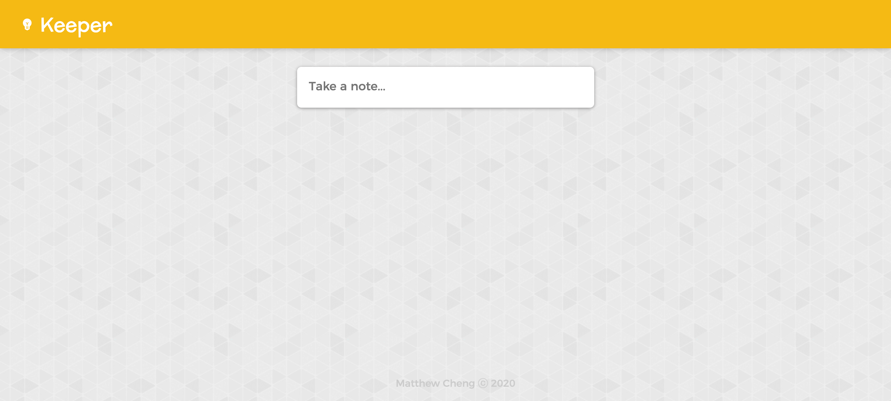
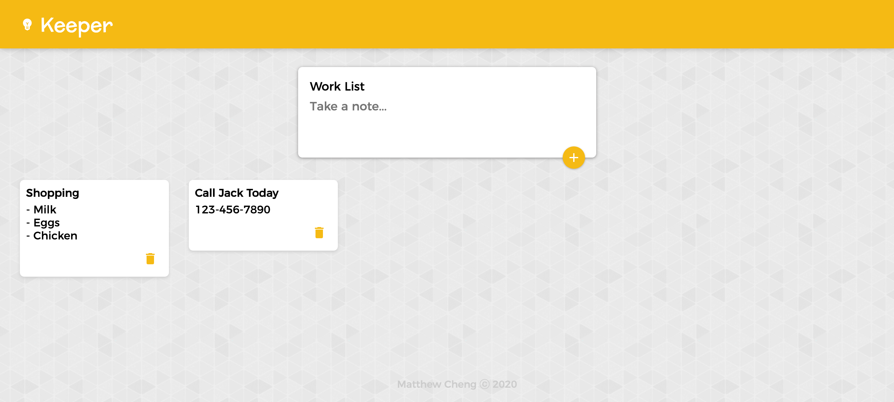

# Keeper App

The Keeper app is a productivity and organizational app similar to Google Keep. The app allows you to quickly take and save notes with a clean and minimal user-interface.

[LIVE DEMO](https://matthewkcheng.github.io/keeper)

## Installation

After downloading the code, cd into the file location and run this in the terminal to get the app running locally.

```bash
keeper $ npm install
keeper $ npm start
```

## Usage

To take a note, click onto the "Take a note..." input.



From there, the input will drop down and you can take a note with a title. Then you can click the "+" button to add the note to the board. To remove a note, simply click the trash icon on the note you wish to delete.



## Tech Stack
* HTML5
* CSS3
* JavaScript
* React.JS

## Contributing
Pull requests are welcome. For major changes, please open an issue first to discuss what you would like to change.

Please make sure to update tests as appropriate.